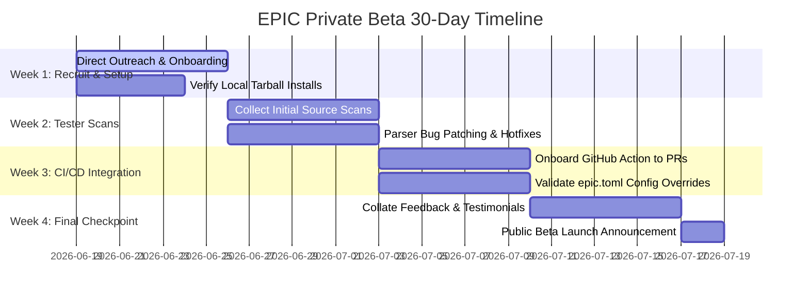

# EPIC v0.1 Private Beta Execution Plan

**Author**: Lead Developer Relations & DX Engineer  
**Version Target**: `0.1.0-beta.1`  
**Duration**: 30-Day Sprint (Acquiring & Verifying Initial Pilots)  

---

## 1. Executive Summary
This document defines the 30-day execution plan to transition EPIC from a feature-complete engineering prototype to a validated developer tool. The goal is to onboard the first 3–5 external Solana protocol engineers, secure direct product feedback on production codebases, and demonstrate utility to validate developer adoption prior to public launch and grant submissions.

---

## 2. Ideal Tester Profiles
We will target three high-value personas to ensure comprehensive validation of EPIC's layout verification capabilities:

1.  **Protocol Lead Engineers (Primary)**
    *   *Why*: They are directly responsible for program upgrades, managing state size allocations, and avoiding mainnet bricking.
    *   *Target Teams*: Mid-tier DeFi protocols, lending markets, and yield aggregators.
2.  **Solana Smart Contract Security Auditors (Secondary)**
    *   *Why*: Audit firms (e.g. OtterSec, Sec3, Neodyme) manually evaluate layout upgrades. Providing them a static check tool creates immediate advocates.
3.  **Squads / DAO Infrastructure Engineers (Tertiary)**
    *   *Why*: They manage program authority multisigs. Integration checks into proposal workflows represent a major future use case.

---

## 3. Targeted Solana Ecosystems

We will recruit candidates from four targeted engineering circles:
*   **Colosseum Founders**: Startup builders in the Colosseum radar/hackathon streams who are actively shipping new upgrades.
*   **Turbin3 Builders (Formerly WBA)**: Top-tier Solana developers trained in core protocol constructs who can provide high-quality developer feedback.
*   **Squads Power Users**: Protocol teams who perform multi-signature program upgrades using Squads and are familiar with the risks of realloc allocations.
*   **Anchor Contributors**: Developers active in the Coral XYZ / Anchor ecosystem who understand IDL formats.

---

## 4. Recruitment Outreach Strategy

### The Funnel Metrics
*   **Target Invitations**: 15 engineers
*   **Expected Conversion Rate**: 33% (yielding 5 active testers)
*   **Onboarding Style**: 1-on-1 direct developer-to-developer setup.

### Outreach Message Template (Direct Message / Telegram / Discord)

> **Subject**: EPIC v0.1 Private Beta — Preventing Solana Upgrade Account Crashes
>
> Hey [Name],
>
> I've been building EPIC, a local-first static analysis tool to prevent **Borsh account serialization crashes and layout offset shifts** during Solana program upgrades.
>
> It parses your Rust structs and Anchor IDL files to compare layout diffs, and flags unsafe upgrades (like middle-inserted fields, field reordering, and type width reductions) inside your CI pipeline as `CRITICAL` findings. We've validated it against historical upgrades from Kamino, Drift, and Squads, achieving 100% accuracy.
>
> We are running a private beta with 5 Solana protocol leads. I'd love to get your feedback on your team's codebase. The setup is completely local (no SaaS, no data leaves your machine) and takes under 5 minutes.
>
> Are you open to running a local layout check on your program?
>
> Best,  
> [Your Name]

---

## 5. 30-Day Operational Timeline

---

## 6. Feedback & Hotfix Triaging Rules

### Hotfix Triggers (Immediate 24-hour patch)
*   **Parser Crashes**: Any `AnalysisError` or regex parser failure caused by standard Rust/Anchor code structures (lifetimes, complex generics, where clauses).
*   **Installation Errors**: Loader failing to locate target pre-built Rust binaries on host platform architectures.
*   **False Negatives**: The comparison engine mapping middle-inserted fields or field swaps to `MAJOR` instead of `CRITICAL`, allowing crash-inducing code to pass gates.

### Deferred Backlog (v0.2+ Roadmaps)
*   **Docker support**: Dockerized `solana-verify` integrations.
*   **Auto-fixing tools**: Suggestions to auto-generate `realloc` instructions.
*   **IDL parsing enhancements**: Support for non-Anchor serialization protocols (e.g. Shank / custom Borsh).

---

## 7. Success Thresholds for Launch Phases

### Checkpoint A: Private Beta Graduation
*   **Required Criteria**:
    1.  **3 distinct Solana protocols** successfully run `epic analyze` and `epic check` locally.
    2.  No open critical bugs or parser crashes reported.
    3.  Avg. setup time under 5 minutes.

### Checkpoint B: GitHub Public Launch Readiness
*   **Required Criteria**:
    1.  **2 protocols** integrate `@epic/github-action` into their live pull-request pipelines, showing green checks on clean PRs.
    2.  `CONTRIBUTING.md` and `CHANGELOG.md` are finalized and verified.
    3.  `private` fields are set to `false` in monorepo packages, and packages are published to the public npm registry under `0.1.0-beta.1`.

### Checkpoint C: Superteam Grant Submission Readiness
*   **Required Criteria**:
    1.  Written positive testimonials from **3 verified Solana protocol leads** outlining how EPIC prevents upgrade hazards.
    2.  A clean, open-source repository containing academic case studies under `docs/research/` demonstrating 100% classification accuracy on historical DeFi hacks.
    3.  Objective proof of developer adoption (GitHub stars, pilot PR runs).
