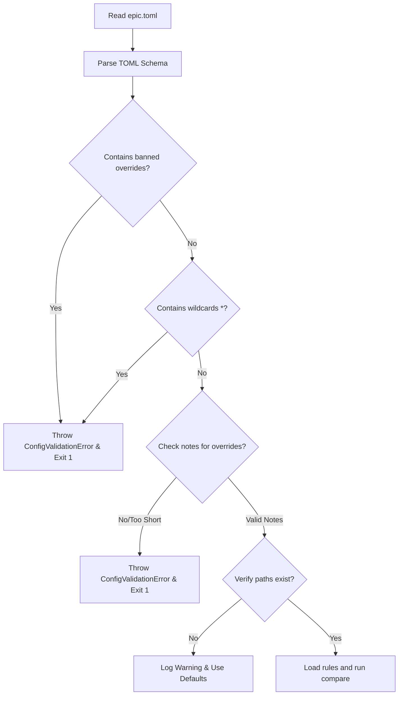

# EPIC Configuration Specification: `epic.toml`

> **Role**: Senior Solana Protocol Engineer & Auditing Lead
> **Status**: Production-Ready Design Spec for EPIC v0.1 Configuration
> **Objective**: Prevent CI noise while maintaining a strict safety boundary for mainnet deployments.

To build trust among top-tier protocol engineers (Drift, Marginfi, Kamino, Squads, Mango), EPIC must support surgical, auditable configuration. If the tool produces noisy warnings, developers will disable it. If it is too permissive, it creates critical security blind spots. 

This document defines the architecture, schema, security guardrails, and implementation plan for `epic.toml`.

---

## 1. Core Architectural Decisions

### Q1: What configuration options should exist?
EPIC's configuration must balance high-level gating rules with low-level structure-specific overrides:
*   **Workspace Settings (`[workspace]`)**:
    *   `compare_mode`: Source of truth for structural comparison. Options are `"ast"` (Rust AST parsing) or `"idl"` (Anchor IDL JSON parsing).
    *   `fail_on_severity`: The minimum severity level required to exit with a non-zero code. Options are `"SAFE"`, `"MINOR"`, `"MAJOR"`, and `"CRITICAL"`.
    *   `rpc_url`: The RPC endpoint used to query on-chain account sizes and state data for live comparison.
    *   `exclude_paths`: Array of glob patterns defining paths/files to exclude from AST scanning (e.g., tests, fixtures, or third-party crates).
    *   `enforce_padding`: Boolean flag. If true, checks that padding fields use standardized names (e.g., starting with `padding` or `reserved`).
*   **Program Settings (`[programs.<name>]`)**:
    *   `path`: Relative path to the program directory from the workspace root.
    *   `id`: The program's on-chain public key.
    *   `idl_path`: Path to the local Anchor IDL JSON file (specifically used if `compare_mode = "idl"`).
*   **Overrides (`[[programs.<name>.overrides]]`)**:
    *   `account`: Target account struct name (e.g., `UserState`, `Bank`).
    *   `finding`: The specific warning/error kind (`FIELD_ADDED`, `FIELD_REMOVED`, `FIELD_REORDERED`, `TYPE_CHANGED`).
    *   `field`: The specific field being modified (optional for struct-wide issues like reordering).
    *   `action`: Action to take. Options are `"allow"` (mute completely) or `"downgrade"` (reduce severity).
    *   `severity`: Target severity if `action` is `"downgrade"`. Options are `"SAFE"`, `"MINOR"`, `"MAJOR"`.
    *   `note`: Mandatory human-readable explanation of why this override is safe.

---

### Q2: What should teams be able to ignore?
Developers should be allowed to bypass warnings for operations that do not cause memory corruption or deserialization failures:
1.  **Trailing Field Additions (`FIELD_ADDED` at the end)**:
    *   *Safety Justification*: If an account was allocated with extra headroom (e.g., Anchor's `space = 1000` when the fields only use 200 bytes), appending new fields at the end of the struct does not shift the offsets of existing fields. Existing on-chain accounts remain fully deserializable.
2.  **Padding Repurposing (Size-Neutral Substitution)**:
    *   *Safety Justification*: Replaced reserved padding bytes (e.g., changing `reserved: [u8; 64]` to `new_field: u64` and `reserved: [u8; 56]`) is a standard Solana pattern. As long as the offset of every subsequent field remains identical and the total struct size is conserved, this is 100% safe.
3.  **Enum Variant Additions (Append-Only)**:
    *   *Safety Justification*: Borsh encodes enum variants using a single-byte index. Appending a new variant at the end of an enum does not change the serialized representation of existing variants.
4.  **Transient Struct Modifications**:
    *   *Safety Justification*: Structs used strictly as instruction parameters or event payloads do not persist on-chain. Changing their layout might break client SDKs, but it will never corrupt on-chain state.

---

### Q3: What should NEVER be ignorable?
Certain structural mutations introduce silent state corruption or crash on-chain execution. EPIC must refuse to ignore or downgrade these findings:
1.  **Field Reordering (`FIELD_REORDERED`)**:
    *   *Danger*: Swapping field positions shifts the byte offsets of existing data. Deserializing old accounts will load wrong variables into memory (e.g., loading a user's token balance into their borrow limit), causing critical security breaches.
2.  **Field Removal (`FIELD_REMOVED`)**:
    *   *Danger*: Removing a field shifts the offsets of all subsequent fields and shrinks the struct size, causing deserialization length checks to fail immediately.
3.  **Non-Trailing Type Width Changes (`TYPE_CHANGED`)**:
    *   *Danger*: Changing a field type (e.g., `u64 -> u128` or `Pubkey -> [u8; 32]`) inside a struct shifts the offset of every trailing field.
4.  **PDA Seed Reordering or Deletion**:
    *   *Danger*: Modifying the order or composition of seeds changes the derived PDA addresses, orphaning all existing accounts created under the old seeds.
5.  **Global Safety Mutes**:
    *   *Danger*: Muting all errors globally (e.g., `fail_on_severity = "NONE"`) or disabling checks for a whole program.

---

### Q4: How should severity overrides work?
Overrides must be declared with surgical precision in the `epic.toml` configuration:
*   **Scoped Mapping**: Overrides apply only to a specific program, account struct, and field. Global wildcards are strictly prohibited.
*   **Action Tiers**:
    *   `action = "allow"`: Treats the finding as `SAFE` (effectively silencing it).
    *   `action = "downgrade"`: Lowers the severity to a specified target (e.g., `MAJOR` -> `MINOR`).
*   **Mandatory Auditing**: The `note` field must be present and contain a description explaining the safety mitigation.
*   **Gated Execution**: If an override attempts to modify a non-ignorable finding (such as `FIELD_REMOVED` or `FIELD_REORDERED`), the parser throws a `ConfigValidationError` and exits with code `1` immediately, stopping the CI pipeline.

---

### Q5: Workspace-level vs. Program-level configs?
In a monorepo setup containing multiple Solana programs, configuration is structured hierarchically:
*   **Workspace-level `epic.toml`**:
    *   Located at the monorepo root.
    *   Defines global parameters (`compare_mode`, `fail_on_severity`, `rpc_url`, `exclude_paths`).
    *   Registers program paths and their corresponding on-chain IDs:
        ```toml
        [programs]
        drift = { path = "./programs/drift", id = "dRifv2G2XadHceee5mK3dB6vJ61g2QskXn8o1sBDR1B", idl_path = "./target/idl/drift.json" }
        marginfi = { path = "./programs/marginfi", id = "MFv28xrwG2k1GZnhwYhcz1GL9G7gW4mh99PP5zER6NL", idl_path = "./target/idl/marginfi.json" }
        ```
*   **Program-level `epic.toml`**:
    *   Located within the program's subdirectory (e.g., `./programs/drift/epic.toml`).
    *   Contains program-specific overrides and unique exclusion filters.
*   **Precedence & Merge Semantics**:
    1.  The local program-level `epic.toml` overrides any workspace-level default.
    2.  If both define overrides for the same account and field, the program-level override is prioritized.
    3.  If no program-level config exists, the workspace-level rules are applied globally.

---

### Q6: How should CI environments consume the config?
*   **Auto-discovery**: The EPIC CLI scans parent directories to find a root `epic.toml` or program-level configs.
*   **Strict Gating**: Running EPIC with the `--strict` flag in CI enforces additional validation:
    *   Ensures all overrides have `note` comments.
    *   Fails the build if any override is "stale" (defines an override for a field or struct that was not modified in the PR).
*   **Git Diff Tracking**: If a PR modifies `epic.toml` itself, the GitHub Action detects this and flags it in the PR comment:
    ```markdown
    ⚠️ Warning: Configuration file `epic.toml` was modified in this PR.
    Review the added overrides to ensure no safety boundaries are being bypassed.
    ```

---

### Q7: What would Drift, Marginfi, Kamino, Squads, and Mango actually configure?

#### A. Drift (Clearing House & User State)
Drift manages highly active accounts with high headroom and wants to allow developers to append trailing fields, but enforce strict gates on anything else.
*   **Config Priority**: Downgrade `FIELD_ADDED` for trailing fields in the `User` struct from `MAJOR` to `SAFE` after confirming size constraints.

#### B. Marginfi (Bank & Risk Parameters)
Marginfi makes heavy use of reserved padding bytes (`reserved: [u8; 64]`) in their `Bank` and `MarginRequirement` structs. They repurpose these arrays during upgrades.
*   **Config Priority**: Allow `PADDING_REPURPOSE` for the `Bank` and `MarginRequirement` structs, validating that the offset alignments are preserved.

#### C. Kamino (Reserve & Lending Market)
Kamino has complex nested configurations (e.g., `Reserve`, `Obligation`, `LendingMarket`). They might want to restrict their comparison strictly to IDL output because their build system compiles artifact IDLs.
*   **Config Priority**: Set `compare_mode = "idl"` and configure explicit overrides for their complex structs, ensuring that nested struct layout updates are flagged correctly.

#### D. Squads (Multisig & Smart Accounts)
Squads structures must be as small as possible to minimize rent costs for users initializing multisigs. They rarely change account structures and have a zero-tolerance policy.
*   **Config Priority**: Set `fail_on_severity = "MAJOR"`, enforce strict padding checks (`enforce_padding = true`), and disable almost all override options to keep their smart account layouts completely locked down.

#### E. Mango (Perpetuals & Oracles)
Mango has massive state configurations with hundreds of fields and cross-margined accounts. They might have mock test programs in their codebase that should be ignored by the scanner.
*   **Config Priority**: Add `exclude_paths = ["tests/**", "programs/mock-oracle/**"]` to avoid scanning test files.

---

### Q8: What configuration mistakes could create security blind spots?
*   **Stale Overrides**: Leaving an override active in `epic.toml` after the upgrade is deployed. If a developer accidentally breaks that same field in a later PR, the stale override will silence the warning.
*   **Permissive Gating**: Setting `fail_on_severity = "CRITICAL"` but classifying account size shrinkage or field addition as `MAJOR`, which will not fail the CI.
*   **Path Exclusion Abuse**: Excluding entire directories (e.g., `exclude_paths = ["programs/core/**"]`) because of temporary compilation issues, forgetting to re-enable them, and merging unvalidated layout changes.

---

### Q9: How do we prevent developers from disabling the entire product?
EPIC implements hardcoded safeguards that cannot be bypassed via configuration:
1.  **No Wildcards**: The CLI will throw an error if `account = "*"` or `field = "*"` is specified in any override.
2.  **The Unbreakables (Banned Overrides)**: Any override that attempts to `allow` or `downgrade` a `FIELD_REMOVED` or `FIELD_REORDERED` finding will cause a configuration validation crash.
3.  **Strict Audit Trail**: A `note` property is strictly required for every single override. If `note` is missing or shorter than 10 characters, the configuration fails validation.
4.  **No "Global Mute" Option**: There is no `workspace.disable = true` or `ignore_all = true` setting.
5.  **Git Diff Validation**: The GitHub Action checks if `epic.toml` was modified. If a developer attempts to add a new override, it is prominently highlighted in the PR comment.

---

## 2. Complete `epic.toml` Schema (v0.1)

```toml
# ==============================================================================
# EPIC Configuration System - v0.1 Schema
# ==============================================================================

[workspace]
# Source of truth for comparison. "ast" (Rust AST parser) or "idl" (Anchor IDL JSON)
compare_mode = "ast"

# Minimum severity to trigger non-zero exit code (CI failure).
# Options: "SAFE", "MINOR", "MAJOR", "CRITICAL"
fail_on_severity = "MAJOR"

# RPC Endpoint used to fetch live chain state sizes to compare against local calculations.
rpc_url = "https://api.mainnet-beta.solana.com"

# Array of glob patterns to exclude from analysis.
exclude_paths = [
    "**/tests/**",
    "**/mocks/**",
    "**/target/**",
    "**/node_modules/**"
]

# Standardize padding naming conventions (e.g. checks that padding fields start with "reserved" or "padding")
enforce_padding = true

[programs]
# Register active programs. Rel paths and their target on-chain program IDs.
marginfi = { path = "./programs/marginfi", id = "MFv28xrwG2k1GZnhwYhcz1GL9G7gW4mh99PP5zER6NL", idl_path = "./target/idl/marginfi.json" }
drift = { path = "./programs/drift", id = "dRifv2G2XadHceee5mK3dB6vJ61g2QskXn8o1sBDR1B", idl_path = "./target/idl/drift.json" }

# ------------------------------------------------------------------------------
# Override Rules (Program Specific)
# ------------------------------------------------------------------------------

[[programs.marginfi.overrides]]
account = "Bank"
finding = "FIELD_ADDED"
field = "new_risk_parameter"
action = "downgrade"
severity = "SAFE"
note = "Verified Bank state has 256 bytes of unallocated headroom space. Adding trailing field is safe."

[[programs.marginfi.overrides]]
account = "UserState"
finding = "PADDING_REPURPOSE"
field = "reserved"
action = "allow"
note = "Repurposing 16 bytes of reserved padding (reserved: [u8; 64] -> reserved: [u8; 48], new_id: u128). Total size preserved."

[[programs.drift.overrides]]
account = "User"
finding = "FIELD_ADDED"
field = "maker_rebate"
action = "downgrade"
severity = "MINOR"
note = "User account has 4000+ bytes of pre-allocated padding. Appending trailing field is safe."
```

---

## 3. Real-world Protocol Profiles

Here is how each protocol would set up their configuration file based on their specific upgrade risk profile.

### A. Drift Configuration (`drift-epic.toml`)
Drift manages highly active accounts with high headroom and wants to allow developers to append trailing fields, but enforce strict gates on anything else.

```toml
[workspace]
compare_mode = "ast"
fail_on_severity = "MAJOR"
rpc_url = "https://api.mainnet-beta.solana.com"
exclude_paths = ["**/tests/**", "**/mocks/**"]
enforce_padding = true

[programs]
drift = { path = "./programs/drift", id = "dRifv2G2XadHceee5mK3dB6vJ61g2QskXn8o1sBDR1B" }

[[programs.drift.overrides]]
account = "User"
finding = "FIELD_ADDED"
field = "custom_margin_ratio"
action = "downgrade"
severity = "SAFE"
note = "User account has preallocated buffer space of 1024 bytes. Adding to the end is safe."
```

### B. Marginfi Configuration (`marginfi-epic.toml`)
Marginfi utilizes explicit reserved arrays inside risk assets. Their primary need is allowing padding repurposings.

```toml
[workspace]
compare_mode = "ast"
fail_on_severity = "MAJOR"
rpc_url = "https://api.mainnet-beta.solana.com"
exclude_paths = ["**/tests/**", "**/mocks/**"]

[programs]
marginfi = { path = "./programs/marginfi", id = "MFv28xrwG2k1GZnhwYhcz1GL9G7gW4mh99PP5zER6NL" }

[[programs.marginfi.overrides]]
account = "Bank"
finding = "PADDING_REPURPOSE"
field = "reserved"
action = "allow"
note = "Replaced reserved: [u8; 64] with new_stat: u64 and reserved: [u8; 56]. Layout verified."
```

### C. Kamino Configuration (`kamino-epic.toml`)
Kamino leverages a strict build system where Anchor IDLs are compiled and committed. They choose to run validation on IDLs directly.

```toml
[workspace]
compare_mode = "idl"
fail_on_severity = "MAJOR"
rpc_url = "https://api.mainnet-beta.solana.com"
exclude_paths = []

[programs]
kamino = { path = "./programs/kamino", id = "KLend2g6V1CwRsNsGBZJe4wBdaA3p5pQhC4reG2HnL", idl_path = "./target/idl/kamino_lending.json" }

[[programs.kamino.overrides]]
account = "Reserve"
finding = "FIELD_ADDED"
field = "borrow_limit_usd"
action = "downgrade"
severity = "SAFE"
note = "Verified the Reserve account has over 500 bytes of unused headroom."
```

### D. Squads Configuration (`squads-epic.toml`)
Squads maintains tight sizing layouts. They rarely change their account structure and want a zero-tolerance policy. No overrides are permitted.

```toml
[workspace]
compare_mode = "ast"
fail_on_severity = "MINOR"
rpc_url = "https://api.mainnet-beta.solana.com"
exclude_paths = ["**/tests/**"]
enforce_padding = true

[programs]
squads_v4 = { path = "./programs/squads_multisig", id = "SQDS4ep65T869zMMBKZTy2258rj45aY13NqTU5cm1T0" }

# NO OVERRIDES DEFINED - Squads defaults to blocking all changes
```

### E. Mango Configuration (`mango-epic.toml`)
Mango has huge multi-collateral accounts. They exclude multiple experimental mock programs from the analysis to prevent false build failures.

```toml
[workspace]
compare_mode = "ast"
fail_on_severity = "MAJOR"
rpc_url = "https://api.mainnet-beta.solana.com"
exclude_paths = [
    "**/tests/**",
    "**/mocks/**",
    "**/programs/experimental-perp/**",
    "**/programs/mock-oracle/**"
]

[programs]
mango_v4 = { path = "./programs/mango_v4", id = "Mango4dmKsZFz2Ww52uCsG47Dk7RMAZ49p4T2F2Yx" }

[[programs.mango_v4.overrides]]
account = "MangoGroup"
finding = "FIELD_ADDED"
field = "new_oracle_index"
action = "downgrade"
severity = "SAFE"
note = "Adding a trailing index for new oracle feed, space verified."
```

---

## 5. Configuration Validation Rules & Gating

The configuration parser asserts these constraints during initialization:



### Unbreakable Rules (Banned Overrides)
The parser rejects the config file if any of the following overrides are found:
1.  `finding = "FIELD_REORDERED"` -> `action = "allow"` or `action = "downgrade"`
2.  `finding = "FIELD_REMOVED"` -> `action = "allow"` or `action = "downgrade"`
3.  `finding = "TYPE_CHANGED"` (where type width shifts offsets) -> `action = "allow"` or `action = "downgrade"`
4.  `account = "*"` or `field = "*"` (Wildcards are completely forbidden)

If any of these conditions are met, EPIC prints:
`Error: epic.toml contains forbidden override. Field reorderings or removals can never be ignored.` and aborts the CI pipeline.

### Default Values (Fallbacks)
If no `epic.toml` exists in the workspace:
*   `compare_mode` defaults to `"ast"`.
*   `fail_on_severity` defaults to `"CRITICAL"`.
*   `exclude_paths` defaults to `["**/tests/**", "**/mocks/**"]`.
*   `enforce_padding` defaults to `false`.
*   `overrides` defaults to `[]` (empty list).

---

## 6. Recommended Implementation Plan

### Phase 1: TOML Parser Integration (Day 1)
*   **Action**: Add a TOML parsing library (e.g., `toml` npm package) to `@epic/parser`.
*   **Deliverable**: Create a TypeScript module `config.ts` in `@epic/parser` that defines the strongly-typed `EpicConfig` interface and reads/parses `epic.toml`.
*   **Verification**: Write unit tests verifying that standard configuration files parse correctly, and validation defaults are populated if fields are omitted.

### Phase 2: Strict Validation Engine (Day 2)
*   **Action**: Write validation routines that run immediately after parsing the TOML file.
*   **Deliverable**: Implement checks for:
    *   Wildcard usage in fields/accounts.
    *   Presence of banned overrides (`FIELD_REORDERED`, `FIELD_REMOVED`, `TYPE_CHANGED`).
    *   Note length validation (minimum 10 characters).
*   **Verification**: Ensure that passing an invalid configuration to the CLI exits with code `1` and outputs a clean, developer-friendly error message.

### Phase 3: Override Resolution Logic (Day 3)
*   **Action**: Integrate the parsed configuration rules into the `@epic/diff-engine` comparison loop.
*   **Deliverable**: Update `compareAccountLayouts` in `packages/diff-engine/src/compare.ts` to fetch the configuration rules. When a finding is generated:
    *   Look up if a matching override exists for the target `program`, `account`, and `field`.
    *   Apply the `action` to downgrade or allow the severity.
*   **Verification**: Run tests with mock overrides and verify that `FIELD_ADDED` is successfully downgraded to `SAFE`, while `FIELD_REORDERED` continues to block the build regardless of configuration settings.

### Phase 4: CI Integration & Stale Override Checking (Day 4)
*   **Action**: Integrate config parsing with the GitHub Action.
*   **Deliverable**: 
    *   The GitHub Action checks if `epic.toml` was modified in the PR.
    *   If a stale override exists (defined in `epic.toml` but the corresponding field was not modified in the current diff), issue a warning in the PR comment.
*   **Verification**: Validate the full execution flow inside a test repository.
