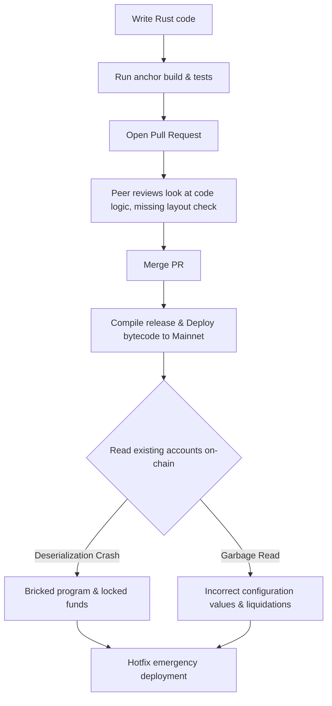
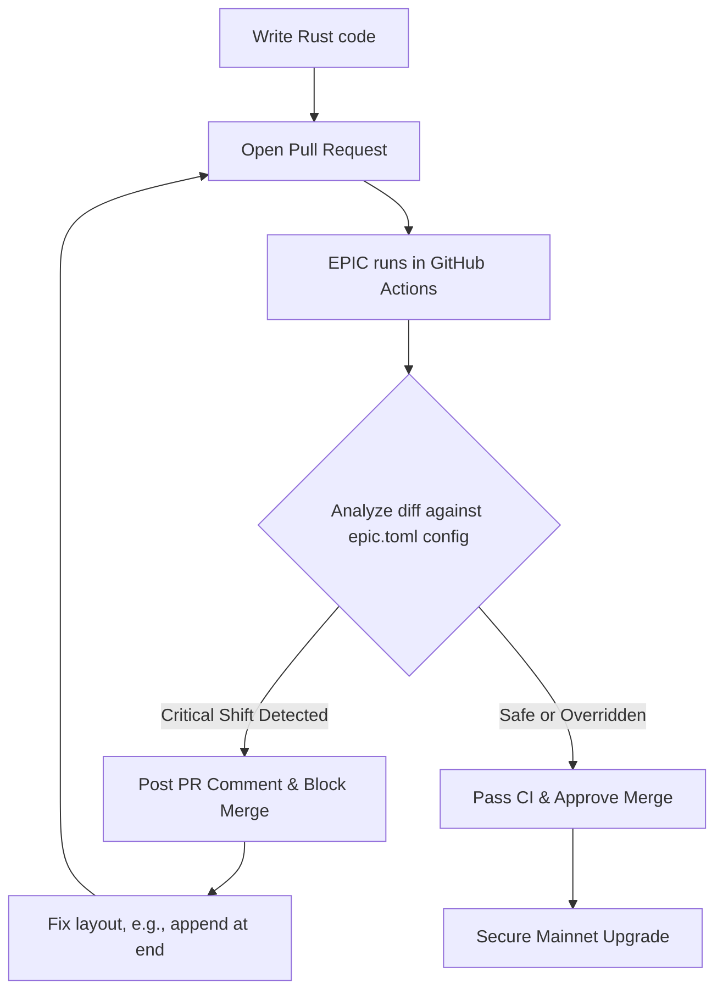

# EPIC Proof-of-Value Case Studies & Workflows

This directory provides concrete, real-world case studies demonstrating how **EPIC (Engineering Platform for Intelligent Contracts)** detects and prevents breaking layout upgrades on Solana.

---

## 1. Case Studies Directory

*   [Drift case study (LP position replacement & User state additions)](file:///Users/aksh/Documents/Solana%20EPIC/docs/examples/drift.md)
*   [Marginfi case study (Padding administration & Delegate bank expansion)](file:///Users/aksh/Documents/Solana%20EPIC/docs/examples/marginfi.md)
*   [Kamino case study (Rewards sizing & Permissioned vault pausing)](file:///Users/aksh/Documents/Solana%20EPIC/docs/examples/kamino.md)
*   [Squads case study (Multisig rent collector layout drift)](file:///Users/aksh/Documents/Solana%20EPIC/docs/examples/squads.md)

---

## 2. The Development Lifecycle: Before vs. After EPIC

### Before EPIC: The Blind Spot Workflow

*   **The Hazard**: Traditional compilers and test suites check if code compiles and runs against *new* test accounts. They do not compare local layout representations against *pre-existing mainnet state*.

### After EPIC: The Guarded Workflow

*   **The Guard**: EPIC runs compile-free layout analysis on the PR, checking for field reorderings, removals, type width adjustments, and size changes. Merge is blocked automatically on unscheduled breaks.

---

## 3. Terminal Output Example

```plaintext
$ epic check ./old-squads ./new-squads

🔍 Analyzing Solana Program Workspace: ./new-squads
Found 11 structs, 2 enums.

═══════════════════════════════
EPIC UPGRADE REPORT
═══════════════════════════════
Program: Squads
Severity: CRITICAL
Finding:
FIELD_ADDED (In-Middle Shift):
Struct: Multisig
Field: rent_collector (Pubkey)
Offset: 64 -> 96 (Shifts all trailing fields by +32 bytes)

Risk:
Layout Drift. Trailing field 'threshold' shifted from 64 to 96. 
Existing Multisig accounts on mainnet will fail to deserialize.

Recommendation:
Do not add fields in the middle of on-chain structs. 
Append new fields strictly to the end of the struct, and ensure realloc is implemented.
```

---

## 4. Developer Value Proposition

### For Protocol Engineers
*   **Eliminates Upgrade Anxiety**: Verify layout changes instantly. No need to write complex simulation scripts just to test if Borsh offsets shifted.
*   **Zero Noise / CI Gating**: Configure surgical overrides in `epic.toml` for padding repurposing or trailing field additions. EPIC will only alert you when a change is genuinely destructive.
*   **100% Local / Zero-SaaS**: EPIC runs entirely in your local terminal and GitHub runners. Zero bytecode or state data is uploaded to external servers.

### For Multisig Signers & Auditors
*   **Human-Readable Audit Trails**: GitHub Action comments show the exact layout changes, applied overrides, and safety justifications.
*   **Bypassing Prohibited**: Developers cannot ignore reorderings or field removals via `epic.toml`. Safety overrides for critical issues are blocked at the compiler level.
*   **Clear Recommendations**: Get precise remediation steps (such as `realloc` sizes or padding modifications) in every comment output.
