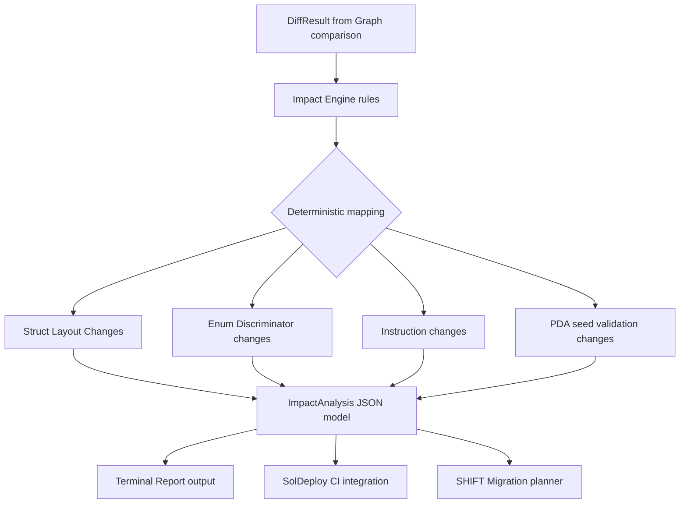

# Solana EPIC - Upgrade Impact Engine Report

## 1. Architecture Overview

The **Upgrade Impact Engine** resides in `packages/parser-v2/src/impact.rs`. It provides a deterministic mapping layer between parsed AST workspace diffs and their operational consequences on Solana. By translating raw structural discrepancies (e.g. `StructFieldRemoval`) into concrete operational risks (e.g. `Account Deserialization Break`), the engine acts as an upgrade oracle for protocol engineers.



### The Structured Data Model
```rust
pub struct ImpactAnalysis {
    pub severity: Severity,
    pub risk_category: String,
    pub impact: Vec<String>,
    pub recommendations: Vec<String>,
    pub migration_required: bool,
}
```

---

## 2. Deterministic Rules Table

| Change Type | Expected Severity | Risk Category | Operational Impact | Recommended Actions | Migration Required |
| :--- | :--- | :--- | :--- | :--- | :--- |
| **`StructFieldRemoval`** | `Critical` | Account Deserialization Break | • Existing PDA accounts incompatible<br>• Existing state may become unreadable | • Create migration instruction<br>• Snapshot affected accounts before upgrade | `Yes` |
| **`StructFieldReordering`** | `Critical` | State Corruption | • Existing serialized data no longer maps correctly<br>• Reading corrupted data will lead to undefined behavior or state locks | • Do not deploy without migration<br>• Create manual state migration scripts | `Yes` |
| **`StructFieldAddition (Middle)`** | `Critical` | Layout Shift | • Field inserted in middle/front shifts offsets of all subsequent fields<br>• Deserializing existing accounts will result in corrupted state | • Do not insert fields in the middle/front of state structs<br>• If necessary, append fields at the end or use a new versioned account structure | `Yes` |
| **`StructFieldAddition (End)`** | `Minor` | Account Expansion | • Existing accounts require realloc<br>• New serialized layout is longer than previous version | • Use Anchor realloc to expand existing accounts<br>• Calculate additional rent exemption costs | `No` |
| **`AccountLayoutChange`** | `Major` | Account Size Shift | • Total byte size of the state account changed<br>• Existing accounts must be resized to fit the new layout | • Ensure proper realloc constraints are added to instructions<br>• Fund additional rent exemption fees for existing accounts | `Yes` |
| **`TypeChange (Different Size)`** | `Major` | Type Width Mismatch | • Field type size changed, shifting subsequent field offsets<br>• Borsh deserialization will fail on old accounts | • Write custom migration to adjust account space and transform values<br>• Validate type size alignment before deployment | `Yes` |
| **`TypeChange (Same Size)`** | `Critical` | Semantic Type Mismatch | • Field type changed without size change (e.g. i64 to u64)<br>• Existing data may decode successfully but with incorrect semantic values | • Perform a thorough audit of the affected field's mathematical bounds<br>• Implement data transformation scripts to validate and convert existing values | `Yes` |
| **`EnumVariantReordering`** | `Critical` | Discriminator Corruption | • Existing enum values may map to different variants<br>• On-chain state logic will behave incorrectly due to variant index shifts | • Breaking upgrade<br>• Migration mandatory | `Yes` |
| **`EnumVariantRemoval`** | `Critical` | Enum Variant Deprecation | • Removing a variant shifts subsequent variant indices in Borsh serialization<br>• Existing accounts containing the removed variant or subsequent variants will fail to deserialize | • Do not remove enum variants<br>• Use an 'Unused' or 'Deprecated' placeholder variant to preserve ordering | `Yes` |
| **`EnumVariantAddition (Middle)`** | `Critical` | Discriminator Shift | • Inserting variant in the middle shifts subsequent variant discriminators<br>• Existing accounts will map to incorrect variants | • Do not insert enum variants in the middle<br>• Only append enum variants at the end of the enum definition | `Yes` |
| **`EnumVariantAddition (End)`** | `Minor` | Enum Expansion | • New enum variant introduced<br>• No impact on existing serialized variant indices | • Rebuild clients to support the new variant<br>• Update matching patterns in program instructions | `No` |
| **`InstructionRemoval`** | `Critical` | Client Compatibility Break | • Existing SDK integrations may fail<br>• Clients attempting to call the removed instruction will fail | • Deprecate before removal<br>• Ensure all client applications have migrated to the new instructions | `No` |
| **`InstructionAddition`** | `Safe` | API Expansion | • New entry point added to the program<br>• No impact on existing instructions or layouts | • Update client SDKs to expose the new instruction<br>• Verify access control constraints on the new instruction | `No` |
| **`PdaAccountDefinitionChange`** | `Critical` | PDA Derivation Break | • Changing validation constraints or seeds changes the derived address<br>• Existing PDA accounts become inaccessible or unreachable | • Validate that seed alterations are backwards-compatible<br>• Create fallback address resolution if changing seeds | `Yes` |
| **`IdlBreakingChange`** | `Critical` | IDL Interface Break | • Serialized interface structure has changed<br>• Deserialization of accounts or instructions will fail on clients using the old IDL | • Regenerate and deploy the updated IDL<br>• Rebuild and redeploy all dependent client applications | `Yes` |

---

## 3. Real Solana Examples

### Case A: Squads V4 Multisig Upgrade (`rent_collector` insertion)
*   **ABI Changes**: Removed `_reserved` (`u8`), added `rent_collector` (`Option<Pubkey>`).
*   **Severity**: `Critical`
*   **Risks Detected**: `Account Deserialization Break`, `Layout Shift`
*   **Operational Output**:
    ```text
    ═══════════════════════════════
    CRITICAL UPGRADE WARNING
    ═══════════════════════════════
    Program: Multisig

    Risk:
    Account Deserialization Break, Layout Shift

    Impact:
    • Existing PDA accounts incompatible
    • Existing state may become unreadable
    • Field inserted in middle/front shifts offsets of all subsequent fields
    • Deserializing existing accounts will result in corrupted state

    Recommended Actions:
    • Create migration instruction
    • Snapshot affected accounts before upgrade
    • Do not insert fields in the middle/front of state structs
    • If necessary, append fields at the end or use a new versioned account structure
    ```

### Case B: MarginFi V2 Group Upgrade (utilizing padding)
*   **ABI Changes**: Added 5 new fields in place of `_padding_0`.
*   **Severity**: `Critical`
*   **Risks Detected**: `Layout Shift`, `Type Width Mismatch`
*   **Operational Output**:
    ```text
    ═══════════════════════════════
    CRITICAL UPGRADE WARNING
    ═══════════════════════════════
    Program: MarginfiGroup

    Risk:
    Type Width Mismatch, Layout Shift

    Impact:
    • Field type size changed, shifting subsequent field offsets
    • Borsh deserialization will fail on old accounts
    • Field inserted in middle/front shifts offsets of all subsequent fields
    • Deserializing existing accounts will result in corrupted state

    Recommended Actions:
    • Write custom migration to adjust account space and transform values
    • Validate type size alignment before deployment
    • Do not insert fields in the middle/front of state structs
    • If necessary, append fields at the end or use a new versioned account structure
    ```

---

## 4. Future Integration Points

### A. SolDeploy (CI / Git Gates)
*   **Role**: Gatekeeper of mainnet deployments.
*   **Integration**: SolDeploy reads the structured `ImpactAnalysis` JSON.
*   **Policy Enforcement**:
    *   If `severity == Critical` and `migration_required == true`, SolDeploy halts the build with `Exit 1` and posts the terminal report in the PR comments to prevent accidental deployment of layout breaks.
    *   If `severity == Major`, SolDeploy checks for matching `realloc` instructions before approving a release plan.

### B. SHIFT (State Migration Engine)
*   **Role**: Interactive planner for state migrations.
*   **Integration**: SHIFT uses the `impact` and `recommendations` list to auto-document what tasks a custom migration instruction must complete.
*   **Execution**: Ingests the list of affected accounts (from `compare_workspaces`) and automatically constructs test templates for `solana-bankrun` to verify that the upgrade does not brick state.
